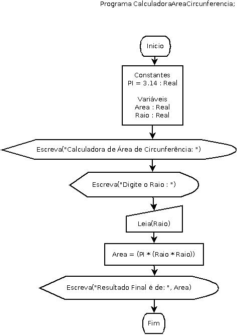

# CalculadoraCircunferenciaEmDiagramaDeBlocos

**Calculadora De Área de Circunferência em Diagrama de Blocos | Fluxograma**

## Enunciado

**Elaborar um programa de computador que calcule a área de uma circunferência e apresente a medida da área calculada.**

   

Autor: Erick Leite Freire 
Criado em: 21-10-2023 
Site: [Escola do Autodidata](https://www.escoladoautodidata.com.br) 
